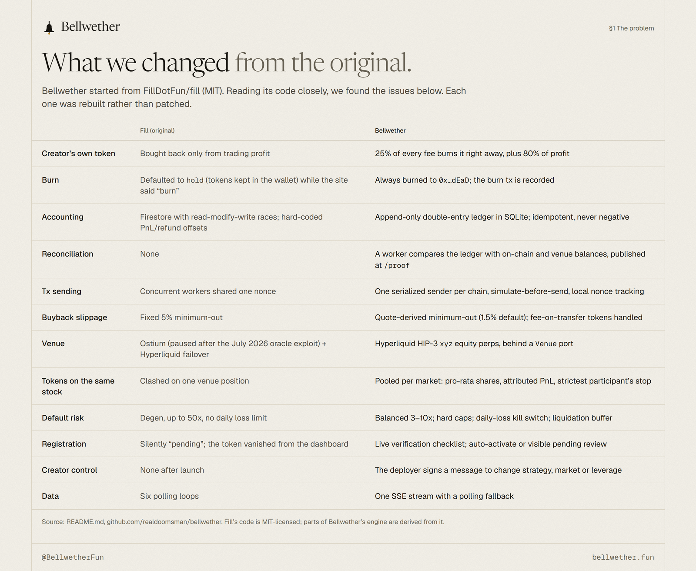
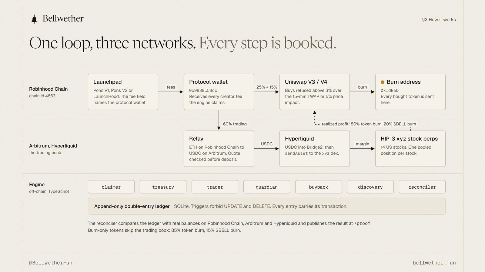
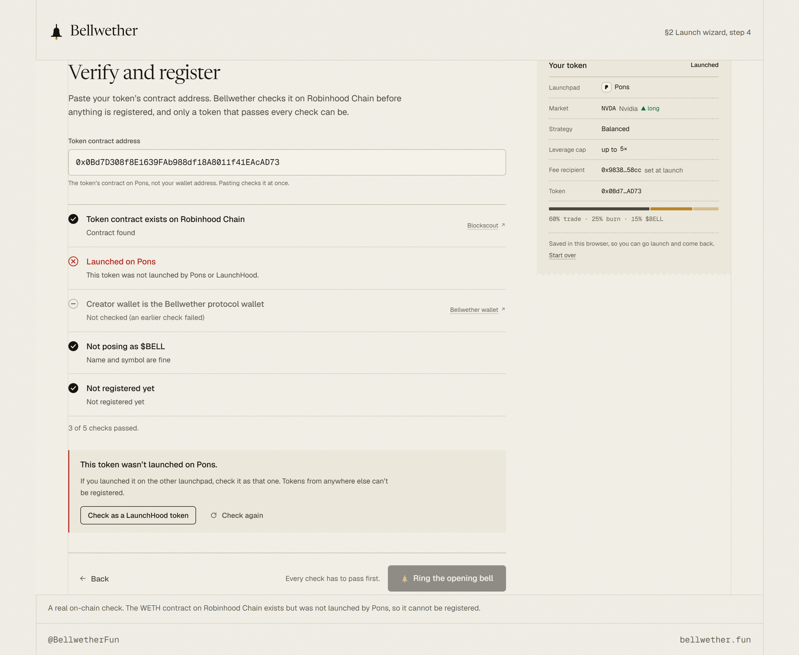
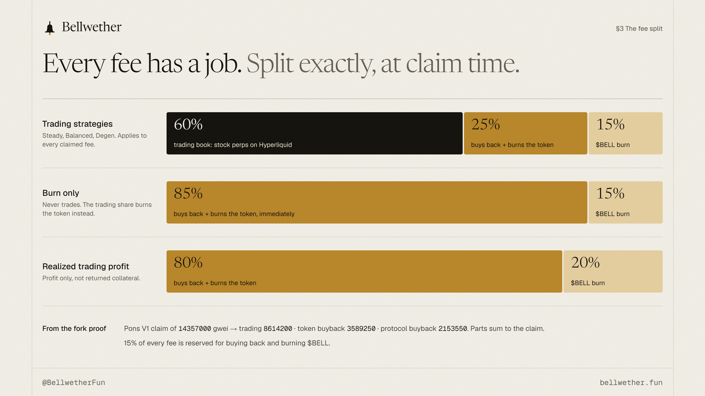
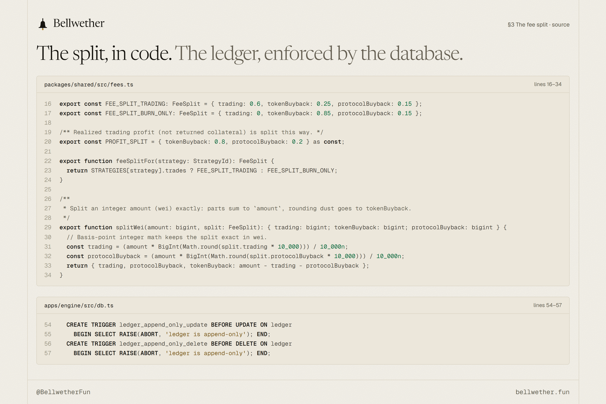
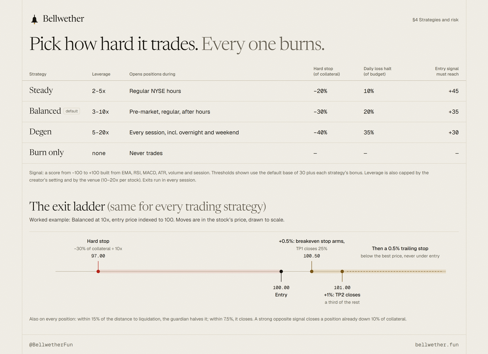
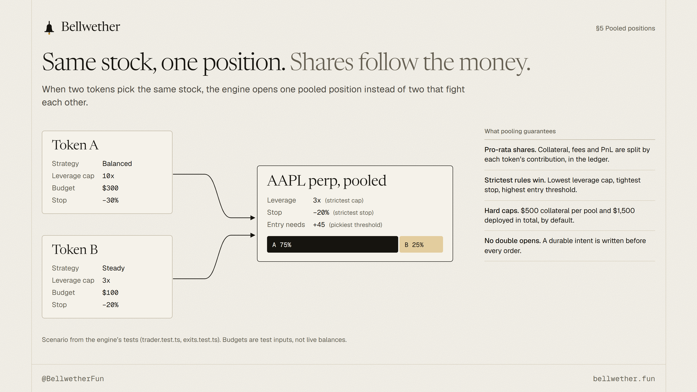
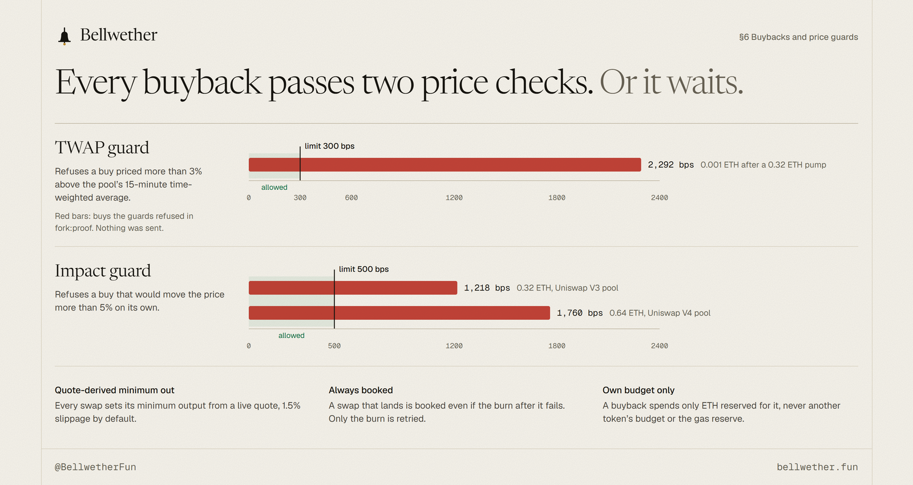
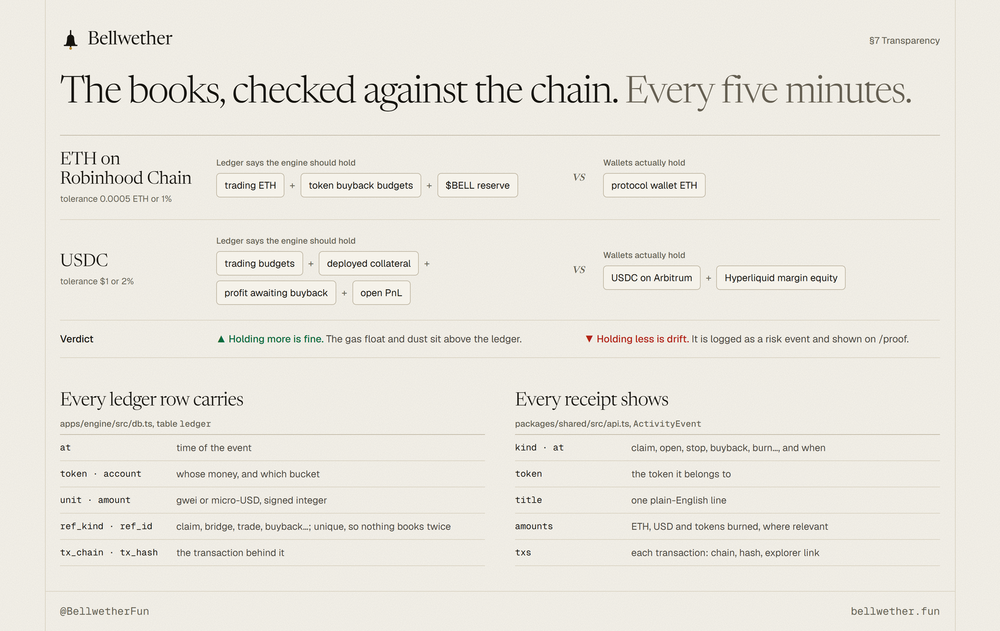
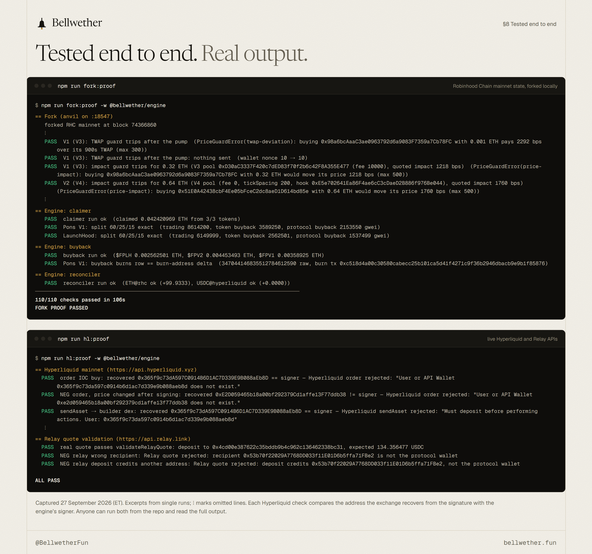

# Bellwether: every creator fee has a job, and every job leaves a receipt

Bellwether turns a memecoin's creator fees into a buy-and-burn engine that also trades tokenized US-stock perpetuals. A creator launches on Pons or LaunchHood on Robinhood Chain and names the Bellwether protocol wallet as the fee recipient. From then on the engine claims the fees as they accrue, splits each claim to the wei, burns part of it straight away, trades the rest on Hyperliquid, and puts trading profit back into buybacks. Every claim, bridge, trade, buyback and burn is written to an append-only ledger with its transaction, and a reconciler checks those books against real balances.

This write-up covers how the engine works end to end, how its books are kept and checked, and how it is tested against Robinhood Chain mainnet state and the live Hyperliquid exchange.

## The problem: creator fees nobody can see

Launchpads pay a token's creator a share of its trading fees. To holders, that stream is invisible. It lands in a wallet, and from there it may be sold, held or spent. Nothing ties it to the token that produced it, and nobody reports on it.

Projects that promise "fees fund something" try to fix this. Bellwether started from one of them: FillDotFun/fill, an MIT-licensed project that routed fees into trading. We read its code closely before building on it and found problems that matter to anyone whose fees it handles:

- The burn step defaulted to holding tokens in the wallet, while the site described them as burned.
- Accounting lived in Firestore with read-modify-write races, and PnL and refunds used hard-coded offsets.
- Concurrent workers shared a single nonce.
- Buybacks used a fixed 5% slippage floor.
- The default strategy allowed 50x leverage with no daily loss limit.
- Its main perp venue, Ostium, was paused after an oracle exploit in July 2026.

Each of these is common in a project that moves fast. Together they mean nobody, the operators included, could say for certain where a given fee went. Bellwether is a rebuild around one rule: every fee has a job, and every job leaves a receipt anyone can check.

## How it works, end to end

1. **Launch.** A creator launches on Pons (V1 or V2) or LaunchHood as they normally would. The only difference is one field, "Creator wallet" on Pons or "Reward recipient" on LaunchHood, set to the protocol wallet 0x9838d8AA9bEc9209558a65A9950094927EA358cc. There is no contract to deploy.
2. **Register.** The creator pastes the token address into the launch wizard. The engine checks on-chain that the contract exists, that the launchpad's factory created it, that its fee recipient is the protocol wallet, that its name doesn't imitate $BELL (Cyrillic and Greek look-alikes included), and that it isn't already registered. A discovery worker also finds tokens that set the wallet but never registered.
3. **Claim and split.** The claimer collects fees as they accrue and splits each claim with integer math. On Pons V1 and LaunchHood part of the fee arrives in the token itself; that part is burned directly.
4. **Burn.** The buyback worker buys the token on Uniswap (V3 for Pons V1 and LaunchHood, V4 for Pons V2) and sends it to the burn address, 0x…dEaD.
5. **Trade.** The trading share is bridged with Relay from ETH on Robinhood Chain to USDC on Arbitrum, deposited to Hyperliquid, and used as margin for HIP-3 equity perps on the xyz dex: AAPL, TSLA, NVDA, MSFT, GOOGL, AMZN, META, HOOD, COIN, MSTR, NFLX, AMD, PLTR and AVGO.
6. **Return.** Realized profit is netted against trading ETH still waiting on Robinhood Chain. That ETH becomes buyback budget and the USDC stays on the venue as margin, so profit reaches the burn without a round trip across bridges.

The engine is TypeScript end to end. Seven workers (claimer, treasury, trader, guardian, buyback, discovery, reconciler) run under one global execution lock, and each chain has one serialized transaction sender that simulates every transaction before sending it.

## The fee split

Every claim is split the moment it is booked:

- **Trading strategies:** 60% to the token's trading book, 25% buys back and burns the token immediately, 15% is reserved for buying back and burning $BELL.
- **Burn only:** 0% trading, 85% token burn, 15% reserved for the $BELL burn.
- **Realized trading profit** (not returned collateral): 80% buys back and burns the token, 20% goes to the $BELL burn.

The 25% is the important number. In the original design a creator's token was bought back only out of trading profit, so a losing book meant no buybacks at all. Here a quarter of every fee reaches the token's own chart as soon as it is claimed, whatever the trading book does.

The split runs in wei with basis-point integer math. Rounding dust goes to the token buyback, so the parts always sum to the claim. In the fork proof below, a Pons V1 claim of 14,357,000 gwei split into 8,614,200 for trading, 3,589,250 for the token buyback and 2,153,550 for the protocol buyback.

## Strategies and risk controls

A creator picks one of four strategies. The three trading strategies differ in leverage, the sessions in which they may open positions, the hard stop, the daily loss halt and how strong the entry signal must be. Burn only never trades.

The entry signal is a score from −100 to +100 built from EMA, RSI, MACD, ATR, volume and the market session. A position opens only when the score clears the strategy's threshold. Every position then follows the same exit ladder: a breakeven stop arms once the stock moves 0.5% in the position's favor, the first take-profit closes 25% at +0.5%, the second closes a third of the rest at +1%, and the remainder rides a 0.5% trailing stop.

Around the strategies sit engine-wide controls:

- Hard caps on collateral per pool ($500) and in total ($1,500) by default.
- A liquidation buffer: the guardian halves a position that gets close to liquidation, then closes it if it gets closer.
- A global daily loss limit ($300 by default) that turns on the kill switch automatically.
- An operator kill switch that stops new positions, buybacks, bridging and margin top-ups while exits and pending burns keep running.
- Pending-open intents: a durable record is written before every order, so a crash between a fill and its bookkeeping can't produce a second position.

The creator keeps control after launch. The token's deployer can change strategy, market or leverage by signing a human-readable message, with no gas. The message lists the site, chain, token, every setting, a nonce and an expiry, so a signature for one set of settings can't be redeemed for another.

## Pooled positions

Tokens that pick the same stock don't open competing positions. The trader pools their budgets into one position per market, and each token owns a pro-rata share of its collateral, fees and PnL in the ledger. The strictest participant sets the rules: the lowest leverage cap, the tightest stop and the highest entry threshold. When a Degen token and a Steady token share a position, it runs under Steady's cap, stop and entry threshold.

## Buybacks and price guards

A scheduled buyback is easy to exploit: anyone who expects a buy can push the price up first. So the buyback worker refuses a swap when the execution price is more than 3% above the pool's 15-minute TWAP, or when the swap itself would move the price more than 5%. A refusal is a skip, not a failure; the budget waits for the next run. Minimum output comes from a live quote (1.5% slippage by default), not a fixed floor.

Two more rules protect the books. A swap that lands is always booked, even if the burn transfer after it fails; the tokens are held as a pending burn and only the burn is retried. And each buyback may spend only ETH the wallet holds beyond the gas reserve and every other reservation, so one token's budget never covers another's.

Each token page shows a burn meter: the share of supply burned, tokens burned, ETH spent and what is queued for the next burn.

## Transparency: ledger, reconciliation, receipts

Three things make the numbers checkable.

**The ledger.** Every movement of value is a double-entry row in SQLite. Database triggers reject UPDATE and DELETE on the ledger table, so history can only be appended. Entries are idempotent by reference, so a retried claim can't be booked twice, and balances can never go negative.

**The reconciler.** Every five minutes, it compares what the ledger says the engine should hold with actual balances on Robinhood Chain, Arbitrum and Hyperliquid. The result is published at /proof under the headline "The books balance." Holding more than expected is fine (gas float, dust). Holding less is drift, logged as a risk event and shown on the page.

**Receipts.** Every claim, bridge, trade, stop, buyback and burn appears in the activity feed with a plain-English summary, its amounts and each transaction behind it, linked to the block explorer.

## Tested end to end

The repository ships five proof scripts that exercise the engine's write paths against real contracts and real APIs. Anyone can run them:

- **fork:proof** forks Robinhood Chain mainnet locally. It launches real tokens on the Pons V1, Pons V2 and LaunchHood contracts, trades them to generate fees, claims the fees, and buys back and burns through Uniswap V3 and V4. Then it runs the engine's own claimer, buyback and reconciler workers in live mode. Every booked amount has to match the on-chain change exactly. In the run shown below, 110 of 110 checks passed in 106 seconds, and the price guards refused buys at 2,292 bps over TWAP and at 1,218 and 1,760 bps of price impact.
- **hl:proof** signs every Hyperliquid action the engine uses (leverage, IOC orders, sendAsset) and submits it to the live exchange. The exchange recovered our signer on every action. Tampered versions, with a changed price, nonce, amount or network, recovered other addresses. The same script shows the engine's Relay quote validation rejecting eight kinds of tampering.
- **relay:proof** takes a real Relay quote and has the engine's bridge code deposit into Relay's real depository contract on a Robinhood Chain fork, checking the event and exact balance changes.
- **hl-deposit:proof** sends USDC through the engine's deposit path into Hyperliquid's Bridge2 contract on an Arbitrum fork and checks the exact transfer.
- **escrow-scan:proof** checks Pons V2 fee-escrow attribution at production scale against the public RPC.

Alongside these: 127 engine tests plus shared and web suites, CI on every push, and public code. Security and code reviews added bound creator-settings signatures, private RPC handling, rate-limit hardening, stream connection caps, look-alike name checks and Relay deposits pinned to known depository contracts.

## What's next

- **bellwether.fun** is the home of the site, the launch wizard and the proof page.
- **The $BELL launch.** 15% of every fee is reserved for buying back and burning $BELL.
- **Creators on Pons and LaunchHood.** Onboarding the first tokens through the launch wizard.

## Follow along

- The site: https://bellwether.fun
- The launch wizard: https://bellwether.fun/launch
- The books: https://bellwether.fun/proof
- The code, MIT-licensed: https://github.com/realdoomsman/bellwether
- Updates: @BellwetherFun

If you have a token on Pons or LaunchHood, the wizard takes about five minutes. If you read code, fork:proof and hl:proof take about two minutes together once Foundry is installed. If something doesn't add up, say so in public; we would rather fix it there.

---

A bellwether stock leads the market, and ringing the bell opens it. On bellwether.fun, every buyback and burn rings an engraved brass bell and issues a receipt. Perpetuals use leverage and can be liquidated. Nothing here is financial advice.
